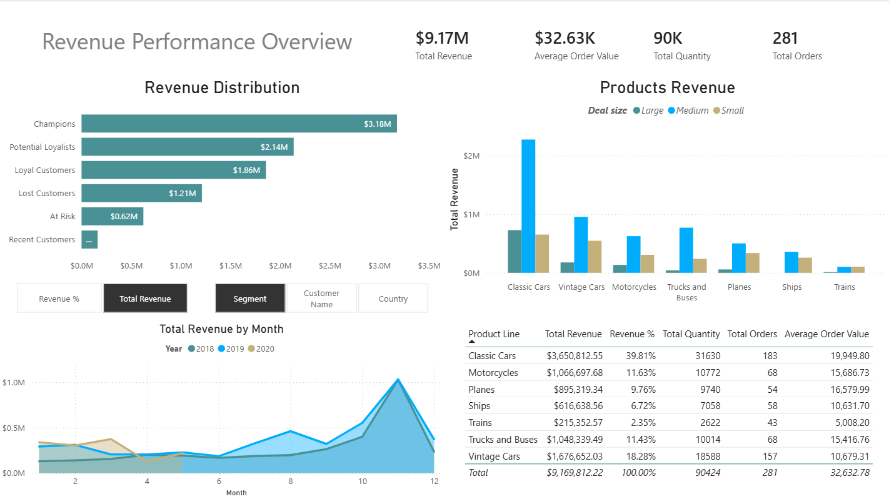

# Sales Performance Analysis — SQL & Power BI

## Project Overview

This project analyzes sales performance of a vehicle scale-model retailer using SQL and Power BI.  
The objective is to identify revenue drivers across customer segments, products, and time trends.

The project includes:

- Data ingestion and cleaning using PostgreSQL
- Exploratory Data Analysis (EDA)
- Customer segmentation using RFM analysis
- Dimensional modeling (Star Schema)
- Interactive Power BI dashboard

---

## Dataset

The dataset used in this project contains historical sales transactions of a vehicle scale-model retailer. Dataset authored by Dhruv D on our Kaggle page.

File location:
data/auto_sales_data

Main variables include:

- ordernumber
- productline
- customername
- sales
- quantityordered
- orderdate
- dealsize
- status
- country

---

# Tools Used

- PostgreSQL
- SQL
- Power BI
- Git / GitHub

---

# Data Pipeline

The project follows a typical analytics pipeline:

Raw Dataset  
↓  
Staging Table  
↓  
Clean Raw Table  
↓  
Exploratory Data Analysis  
↓  
Customer Segmentation (RFM)  
↓  
Star Schema Data Model  
↓  
Power BI Dashboard

---

# SQL Workflow

## 1. Staging Table

A staging table was created with TEXT data types to safely import the CSV dataset and avoid data type errors.

File:
sql/01_staging_table.sql

---

## 2. Data Cleaning

The staging table was transformed into a clean analytical table with correct data types.

Key operations:

- NULL handling
- Data type conversion
- Date parsing
- Removal of empty values

File:
sql/02_raw_cleaning.sql

---

## 3. Exploratory Data Analysis (EDA)

Initial analysis was performed to understand the dataset:

- Order counts
- Customer counts
- Product counts
- Status distribution
- Revenue by product line
- Revenue by country
- Monthly sales trends

A view called `sales_completed` was created to include only valid sales:

File:
sql/03_views_and_eda.sql

---

## 4. Customer Segmentation (RFM)

RFM analysis was implemented to classify customers based on:

- **Recency** → how recently a customer purchased
- **Frequency** → how often they purchase
- **Monetary** → how much they spend

Customers were segmented into groups such as:

- Champions
- Loyal Customers
- Potential Loyalists
- At Risk
- Lost Customers
- Recent Customers

File:
sql/04_rfm_analysis.sql

---

## 5. Data Warehouse Model

A dimensional model (Star Schema) was built to support BI analysis.

Tables created:

**Dimensions**

- dim_customer
- dim_product
- dim_date

**Fact Table**

- fact_sales

File:
slq/05_star_schema.sql

# Power BI Dashboard

The Power BI dashboard analyzes revenue distribution across:

- Customer segments
- Product lines
- Deal sizes
- Monthly sales trends

Main KPIs:

- Total Revenue
- Average Order Value
- Total Quantity Sold
- Total Orders

Dashboard preview:

---

# Key Business Question

How is revenue distributed across customer segments, product categories, and time?