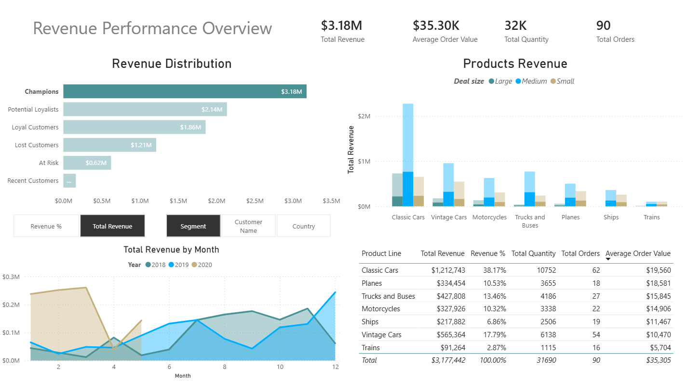

# Commercial Analysis Report

## Objective

The objective of this analysis is to identify the main drivers of revenue across customer segments, product categories, and time periods in order to support commercial decision-making and identify opportunities for revenue growth.

The analysis focuses on understanding:

- Which customer segments generate the most revenue
- Which product lines contribute most to overall sales
- How revenue evolves over time
- Where commercial strategies could improve customer retention and revenue performance

---

# Key Insights

## 1. Revenue Concentration in Specific Product Categories

The analysis shows that **Classic Cars represent the largest share of total revenue**, significantly outperforming other product lines.

This suggests that customer demand is heavily concentrated in a small number of product categories. Classic Cars likely combine **higher demand, higher average order value, or both**, making them the primary commercial driver of the business.

This concentration also implies a potential **product portfolio imbalance**, where a few product categories generate the majority of sales while others contribute marginally.

---

## 2. Customer Value is Highly Concentrated

The RFM segmentation indicates that a relatively small group of customers — classified as **Champion customers** — generates a disproportionately large share of total revenue.

These customers purchase:

- More frequently
- More recently
- And spend more per order

This pattern is common in many businesses and reflects a **highly skewed revenue distribution**, where a minority of customers contribute a large portion of total revenue.

From a commercial perspective, these customers represent the **core revenue base of the company**.

---

## 3. Revenue Risk from Declining Customer Activity

The analysis identifies a group of customers classified as **At Risk**. These customers previously generated significant revenue but have recently reduced or stopped their purchasing activity.

This segment represents an important **revenue recovery opportunity**.

Since these customers have historically demonstrated purchasing behavior, re-engaging them may be more efficient and cost-effective than acquiring completely new customers.

---

## 4. Uneven Product Performance

Product performance is not evenly distributed across the catalog.

While Classic Cars dominate revenue and order volume, several other product lines contribute only a small share of total sales.

This suggests that some product categories may have:

- Lower demand
- Less visibility in the catalog
- Or weaker commercial positioning

Understanding the role of these lower-performing categories could help determine whether they should be repositioned, promoted differently, or potentially reduced in inventory focus.

---

## 5. Seasonal Sales Patterns

Revenue trends show **clear seasonal fluctuations**, with sales peaking toward the end of the year.

Although the dataset does not include external contextual variables, this pattern may be influenced by factors such as:

- Holiday purchasing behavior
- Seasonal promotions
- End-of-year purchasing cycles

This indicates that demand may not be evenly distributed throughout the year, which has implications for both **marketing planning and inventory management**.

---

# Business Recommendations

## 1. Strengthen Retention of High-Value Customers

Champion customers represent the most valuable segment of the customer base.

Protecting and strengthening relationships with these customers should be a commercial priority.

Recommended actions:

- Loyalty or rewards programs
- Early access to new product releases
- Exclusive promotions or bundles
- Personalized communication

Maintaining engagement with these customers helps protect the company’s most important revenue source.

---

## 2. Implement Reactivation Campaigns for At-Risk Customers

Customers classified as **At Risk** previously generated revenue but have recently reduced their activity.

Targeted reactivation strategies could recover a portion of this lost revenue.

Recommended actions:

- Personalized email campaigns
- Time-limited promotions
- Special offers based on previous purchase history

Because these customers already know the brand and have purchased before, the cost of reactivating them may be significantly lower than acquiring new customers.

---

## 3. Leverage High-Performing Product Lines

Given the strong performance of **Classic Cars**, the company could consider strategies to further leverage this product category.

Possible actions include:

- Expanding the range of Classic Car models
- Increasing inventory for high-demand items
- Creating product bundles or cross-selling opportunities with related categories

This approach focuses on strengthening the product categories that already demonstrate strong market demand.

---

## 4. Align Marketing and Inventory with Seasonal Demand

Since revenue peaks toward the end of the year, marketing and operational planning should reflect this seasonality.

Recommended actions:

- Increase marketing efforts before peak demand periods
- Launch targeted promotions ahead of high-demand months
- Ensure inventory levels are prepared in advance

Aligning commercial strategy with seasonal demand patterns can improve both sales performance and operational efficiency.

---

# Limitations of the Analysis

This analysis has several limitations that should be considered when interpreting the results:

1. The dataset covers only **two years and five months**, which may not fully represent long-term demand patterns.

2. The dataset does not include **marketing campaign data**, preventing analysis of the relationship between marketing activity and sales performance.

3. Customer acquisition channels are not available, which limits the ability to evaluate customer acquisition strategies.

4. The dataset focuses on **revenue but does not include cost or margin information**, meaning that profitability cannot be directly assessed.

5. Order cancellations represent a small portion of transactions but could slightly affect revenue estimates.

6. The analysis is based solely on historical transaction data and does not account for **external economic conditions, competitor activity, or market trends**.

---

# Conclusion

The analysis reveals that revenue is strongly concentrated in a small number of product categories and customer segments.

A relatively small group of high-value customers generates a significant share of total revenue, while certain product lines drive most of the company’s sales.

By focusing on:

- Retaining high-value customers
- Reactivating previously engaged customers
- Leveraging high-performing product categories
- Aligning commercial strategy with seasonal demand

the company could potentially improve revenue performance and strengthen its commercial strategy.